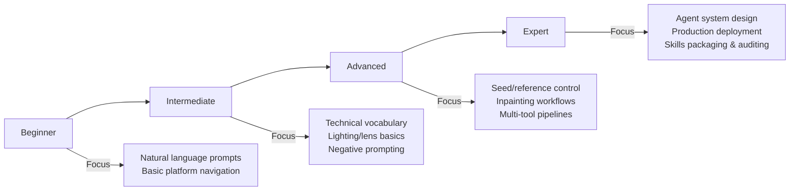

# AI Practitioner Skills Framework (2026)

> A comprehensive, structured reference for core AI skills, sub-skills, and competencies. Designed for learners, professionals, and AI agents.

*Last updated: February 2026 | Version: 3.0 | Format: SKILL.md*

---

## 🎯 Philosophy of Professional Visual Engineering

The shift from "AI Artist" to "Professional Visual Engineer" represents a fundamental reorientation: the practitioner treats AI generation not as magic, but as a precision instrument that responds to physics, psychology, and deliberate architectural choices.

**Core Principles:**
- **Photorealistic Logic First**: Every generation operates within the laws of optics, anatomy, and spatial psychology. The AI models physics; you must understand the physics the AI is modeling.
- **Quiet Luxury of Execution**: Professional work reveals itself through restraint—precise control rather than maximum effect. The mark of expertise is knowing what *not* to prompt.
- **Intentional Architecture**: Structure prompts as you'd architect a building—load-bearing concepts first, decorative elements last. Token order isn't cosmetic; it's structural.
- **Verification as Discipline**: Generation is the beginning, not the end. Systematic quality gates, iteration loops, and mastery checklists separate professionals from enthusiasts.

This framework treats AI image generation as a professional engineering discipline: systematic, physics-informed, quality-gated, and continuously improvable.

---

## 🗺️ Quick Reference: Skill Synergy Map

```
┌─────────────────────────────────────────────────────┐
│                    FOUNDATION                        │
│  Technical Prompt Engineering + Photographic Literacy│
└─────────────┬─────────────────────┬─────────────────┘
              │                     │
              ▼                     ▼
┌─────────────────────┐ ┌─────────────────────────┐
│   CONSISTENCY LAYER │ │   REFINEMENT LAYER      │
│ Strategic Negation  │ │ Post-Processing &       │
│ + Identity Preservation│ │ Hybrid Workflows       │
└─────────────┬───────┘ └──────────┬──────────────┘
              │                    │
              ▼                    ▼
┌─────────────────────────────────────────┐
│           ORCHESTRATION LAYER           │
│      AI Agent Design + Production Deploy│
└─────────────────────────────────────────┘
```

**Key Insight**: Skills compound. Mastery of foundational prompting enables effective consistency control; consistency enables reliable hybrid workflows; reliable workflows enable scalable agent orchestration.

---

## 📚 Core Skill Categories

### 1. Technical Prompt Engineering

*Constructing prompts as structured blueprints, not keyword lists. The input layer for all AI generation.*

| Sub-Skill | Explanation | Tools & Techniques | Example |
|-----------|-------------|-------------------|---------|
| **Scaffold Method** | Structured prompt order: `[Subject] + [Action] + [Lighting] + [Lens/Specs] + [Style] + [Quality]` | Prompt templates, style guides, token-aware editors | `A woman walking in rain + cinematic lighting + 85mm f/1.8 + photorealistic + 4K` |
| **Information Priority (Front-Loading)** | Place critical elements first; AI weights early tokens more heavily | Token analysis, prompt testing | `Oil painting of a castle...` (style first) vs. `A castle, oil painting...` |
| **Photographic Vocabulary** | Use precise technical terms over vague buzzwords | Lens/aperture glossaries, photography references | `85mm lens, f/2.8, shallow depth of field` instead of `hyperrealistic` |
| **Active Voice Editing** | Use clear action verbs for iterative edits and refinements | Inpainting prompts, edit command syntax | `remove the background`, `add a red hat`, `turn the car into a truck` |
| **Agent Prompting Patterns** | Design prompts for multi-step agent workflows using structured reasoning | Zero-shot, few-shot, chain-of-thought, role prompting | `You are a cinematographer. First analyze the scene mood, then specify lighting.` |
| **Long-Horizon Video Scripts** | Maintain narrative coherence across extended video generation sequences | Dialogue-to-script translation, scene continuity prompts, beat sheets | `Scene 1: Close-up on protagonist, golden hour. Transition: Cross-dissolve to wide establishing shot.` |
| **Camera Movement Language** | Specify complex cinematography techniques in text prompts | Camera direction lexicon, film terminology guides | `pull from close-up to wide shot`, `circular tracking shot`, `dolly zoom` |
| **Advanced Prompt Syntax** | Master weighted syntax, conditional prompts, and parameter chaining for precise control | Weight syntax `::`, conditional branches, parameter interpolation, prompt variables | `(masterpiece:1.5), (best quality:1.3), [cinematic lighting] :: 0.8`, `--ar {16:9|9:16} --stylize {250|500}` |
| **Semantic Layering** | Stack semantic concepts in deliberate order to control interpretation hierarchy | Concept ordering, modifier placement, implicit vs explicit directives | `A [serious executive] [in shadows] [dramatic side lighting]` creates different emphasis than `[dramatic side lighting] [serious executive] [in shadows]` |
| **Style Injection Techniques** | Embed artistic references without overriding subject integrity | Style-strength anchors, reference blending, preservation weights | `::0.3` after style reference to preserve subject while adding aesthetic influence |

🔗 **Connects to**: Photographic Literacy (shared vocabulary), Identity Preservation (consistent character direction), Agent Orchestration (scripted agent tasks)

---

### 2. Photographic Literacy

*Reconstructing real-world physics to achieve believable, professional-grade results.*

| Sub-Skill | Explanation | Tools & Techniques | Example |
|-----------|-------------|-------------------|---------|
| **Lighting Pattern Mastery** | Apply classic studio lighting setups to sculpt form, mood, and dimension | Rembrandt, Butterfly, Rim, Split, Loop lighting; 3-point lighting diagrams | `Rembrandt lighting: key light 45° high, fill at 1/4 power, subtle rim for separation` |
| **Lens Selection** | Choose focal length for desired perspective, compression, and emotional effect | Portrait (85-135mm), Standard (35-50mm), Wide (18-24mm); lens simulators | `85mm portrait lens for flattering facial compression and background bokeh` |
| **Focal Length Mapping** | Understand how focal length affects spatial relationships, depth perception, and emotional tone across different subject distances | Compression ratios, perspective distortion curves, subject-to-camera distance mapping | 24mm at 2m = dramatic wide-angle distortion; 135mm at 5m = flattering compression with natural background separation |
| **Optical Physics for AI** | Apply real lens characteristics—bokeh quality, sphere vs. anamorphic rendering, diffraction limits—to prompt believable results | Lens render characteristics, circle of confusion,MTF charts, anamorphic streak patterns | Prompt: `shot on Leica 50mm Summilux, visible anamorphic horizontal flares, organic bokeh circles` |
| **Aperture Control** | Use f-stop to control depth of field and subject isolation | Shallow (f/1.4-f/5.6), Deep (f/8-f/32); DOF calculators | `f/2.8 for subject isolation; f/11 for product shots requiring full sharpness` |
| **Native Resolution Management** | Select output resolution based on use case; understand native detail rendering | 720p (preview), 1080p (enhanced), 4K (professional); resolution tier selection | `Generate at 4K native to capture skin pores and fabric weave; avoid upscaling artifacts` |
| **Vertical Format Mastery** | Compose specifically for 9:16 short-form platforms with platform-aware framing | Subject placement strategies, negative space planning, vertical leading lines | `Center subject with negative space above for TikTok text overlays; use leading lines vertically` |
| **Advanced Rendering Terms** | Use physics-based cues for realistic material response and light interaction | Global illumination, ray tracing, ambient occlusion, subsurface scattering | `subsurface scattering on skin/ears; ambient occlusion in fabric folds and crevices` |
| **Anamorphic Mastery** | Apply cinematic widescreen lens characteristics—horizontal flares, elliptical bokeh, distinctive lens breath—for dramatic scope and visual signature | Anamorphic lens simulation, flare placement, aspect ratio conventions (2.39:1, 2.76:1), squeeze factor awareness | Prompt: `shot on Panavision Primo anamorphic, horizontal blue lens flares, 2.39:1 aspect ratio, oval bokeh highlights` |
| **Cinematic Grammar** | Use film language conventions—coverage, shot progression, visual rhythm—to construct narrative meaning across sequences | Shot-reverse-shot, 180-degree rule, match cuts,visual motifs, color scripting | `Open on wide establishing shot → push in to medium → cut to close-up reaction; parallel editing across two locations` |
| **Executive Portraiture** | Compose authority portraits using psychological signaling—power poses, deliberate lighting hierarchy, environmental context cues | Status signaling, environmental framing, wardrobe psychology, gaze direction, spatial dominance | Prompt: `CEO portrait, corner lighting establishing authority, dark navy suit against library background, slight upward camera angle, confident gaze at viewer` |
| **Quiet Luxury Aesthetic** | Execute understated wealth signaling through restraint—muted palettes, natural materials, absence of logos, tactile quality emphasis | Minimal branding, heritage fabrics, neutral tones, intentional simplicity, craft appreciation | Prompt: `quiet luxury editorial, cream cashmere sweater, matte gold jewelry, no visible logos, soft north window light, textured linen backdrop` |

 🔗 **Connects to**: Technical Prompt Engineering (shared terminology), Strategic Negation (realism standards), Post-Processing (foundation for edits)

---

### 3. Strategic Negation & Skin Mastery

*Telling the AI what *not* to include to overcome unnatural perfection and maintain visual integrity.*

| Sub-Skill | Explanation | Tools & Techniques | Example |
|-----------|-------------|-------------------|---------|
| **Negative Prompting with Weights** | Actively exclude unwanted elements using weighted syntax for precision control | `(unwanted:weight)`, platform-specific negative prompt fields, weight tuning | `(plastic skin:1.4), (cartoon:1.3), (extra fingers:1.4)` |
| **Skin Realism Management** | Simultaneously prompt for natural textures while negating synthetic artifacts | Texture keyword pairs, reference anchoring, skin study libraries | **Prompt**: `visible pores, fine vellus hair, subtle skin variation` **Negate**: `airbrushed, doll-like, waxy, plastic` |
| **Anatomical Correction** | Proactively target common AI generation errors before they appear | Error-specific negative terms, anatomical reference sheets, validation checks | `(fused fingers, extra limbs, double iris, asymmetrical eyes:1.4)` |
| **Temporal Consistency for Video** | Prevent feature drift across video frames using stabilization techniques | Reference locking, error recycling, frame interpolation, motion vectors | Use `--cref` with character sheet + `retraining by error recycling` for stable sequences |
| **Drift Correction** | Feed generation artifacts back into models to improve long-sequence stability | Iterative refinement loops, frame-by-frame feedback, artifact analysis | Generate 10-frame clip → identify drift points → retrain prompt weights → regenerate with corrections |

🔗 **Connects to**: Identity Preservation (consistency foundation), Photographic Literacy (realism standards), Agent Orchestration (automated quality control)

---

### 4. Identity Preservation & Consistency

*Maintaining specific characters, styles, and narratives across multiple generations and scenes.*

| Sub-Skill | Explanation | Tools & Techniques | Example |
|-----------|-------------|-------------------|---------|
| **Seed Locking** | Fix initial noise pattern for controlled variations while changing other parameters | `--seed` parameter, deterministic generation, seed databases | `--seed 12345` to reproduce base composition while varying style modifiers or lighting |
| **Reference Tools** | Use platform-specific reference systems for identity and style preservation | Midjourney `--cref`/`--sref`, SD ControlNet/IP-Adapter, reference embedding | `--cref character_sheet.jpg --sref art_style.jpg --cw 80` |
| **Character Weight (`--cw`)** | Fine-tune reference influence scope from face-only to full appearance preservation | `--cw 0` (face only) to `--cw 100` (full appearance); weight testing | `--cw 80` to preserve face and clothing but allow pose variation and expression changes |
| **Multi-Reference Consistency** | Combine multiple references for complex scene coherence across characters, objects, locations | Up to 4 reference images per generation; reference blending strategies | `char1.jpg + char2.jpg + background.jpg + prop.jpg` for ensemble scene with consistent elements |
| **Agent-Based Consistency** | Leverage specialized agents for narrative coherence across complex multi-scene projects | ScripterAgent, DirectorAgent, Visual-Script Alignment (VSA), coordination protocols | DirectorAgent coordinates Veo 3.1 + Midjourney for cross-scene visual continuity and script fidelity |
| **Visual-Script Alignment (VSA)** | Evaluate and maintain faithfulness between generated visuals and source scripts/storyboards | Similarity metrics, human-in-the-loop checks, automated scoring, deviation thresholds | Score generated frames against storyboard; flag deviations >15% for review and regeneration |

🔗 **Connects to**: Strategic Negation (drift prevention), Post-Processing (consistency refinement), Agent Orchestration (multi-agent narrative control)

---

### 5. Post-Processing & Hybrid Workflows

*Treating AI generation as the start of an iterative, multi-tool creative process—not the final step.*

| Sub-Skill | Explanation | Tools & Techniques | Example |
|-----------|-------------|-------------------|---------|
| **Iterative Refinement (Branching)** | Make small incremental changes while preserving core composition and seed | Seed locking, prompt diffing, version control, A/B testing workflows | Keep `--seed 12345`; change `weather: rainy` → `snowy`; compare outputs side-by-side |
| **Inpainting & Outpainting** | Perform surgical edits to fix errors or expand canvas beyond original generation bounds | Midjourney Vary Region, Photoshop Generative Fill, SD Inpaint, masked editing | Fix malformed hands via targeted inpainting; extend background via intelligent outpainting |
| **External AI Enhancement** | Use specialized tools for final polish, upscaling, and professional finishing | Topaz Photo AI (upscaling/denoising), Lightroom (grading), Runway (motion), ACE++ | Upscale 4K native gen to 8K with Topaz; color grade in Lightroom for cinematic LUT application |
| **Unified Generation-Editing** | Generate, edit, and refine within same model context to reduce tool-switching friction | Qwen Image 2.0, Gemini 2.5 Flash, integrated IDEs, all-in-one platforms | Iterate on image + text overlay + composition adjustments in single interface without context switching |
| **Cross-Domain Compositing** | Blend elements from different sources, styles, or modalities into cohesive final assets | Layer-based tools, masked inpainting, style transfer, alpha compositing | Composite illustrated character into photoreal background via precise masked inpainting and lighting matching |
| **Text Overlay Integration** | Add typography, posters, labels, and multi-lingual text elements during generation phase | Ideogram, Qwen native text rendering, prompt-based typography control | Prompt: `text: "LAUNCH 2026" in bold serif, bottom-center, gold foil texture with subtle drop shadow` |
| **Post-Generation Mastery Checklist** | Systematically verify technical quality, aesthetic coherence, and prompt fidelity before delivery | Error detection workflow, quality gates, peer review protocols | ☐ Check hands/feet anatomy ☐ Verify eye direction consistency ☐ Confirm lighting coherence ☐ Test at target resolution ☐ Review negative prompt coverage ☐ Validate aspect ratio for platform ☐ Confirm color grading consistency ☐ Document seed/reference for reproducibility |

#### 🚀 Production Deployment Skills (Enterprise)

| Sub-Skill | Explanation | Tools & Techniques |
|-----------|-------------|-------------------|
| **Model Serving** | Deploy models via APIs with proper load balancing, latency management, and scaling | REST/gRPC endpoints, Kubernetes orchestration, load balancers, auto-scaling groups |
| **Quantization & Optimization** | Reduce model size and improve inference speed without significant quality loss | ONNX export, TensorRT, GGUF quantization, pruning, distillation techniques |
| **Monitoring & Logging** | Track errors, response times, token usage, and model drift in production environments | Prometheus/Grafana dashboards, custom telemetry, LangSmith, structured logging |
| **CI/CD for AI Pipelines** | Automate testing, validation, and redeployment of GenAI applications and workflows | GitHub Actions, MLflow, model versioning, automated regression testing, canary deployments |

🔗 **Connects to**: All prior categories (refinement layer), Agent Orchestration (deployment automation and scaling)

---

### 6. AI Agent Orchestration *(New for 2026)*

*Designing and managing multi-step, autonomous workflows where AI agents collaborate to achieve complex creative and operational goals.*

| Sub-Skill | Explanation | Tools & Techniques | Example |
|-----------|-------------|-------------------|---------|
| **Agent Architecture Design** | Understand how LLMs call tools, plan execution steps, and maintain contextual memory across interactions | ReAct pattern, Plan-and-Execute, memory buffers, tool-calling schemas | Agent workflow: `search web → summarize findings → generate image → draft social post → schedule publication` |
| **Router Pattern Implementation** | Direct incoming queries to appropriate specialized agents using semantic routing and intent classification | Embedding-based routing, intent classifiers, fallback mechanisms, load-aware dispatch | Query `"create video ad for product launch"` → routed to VideoAgent; `"write blog post"` → TextAgent |
| **SLM Optimization** | Deploy 1B-10B parameter Small Language Models for cost-effective routine tasks with fallback to larger models | Model selection matrices, task routing logic, performance/cost benchmarking, hybrid inference | Use 7B SLM for email drafting and summarization; reserve 70B model for complex strategy and creative direction |
| **Role-Based Agent Teams** | Create specialized agents with distinct responsibilities that collaborate like a human creative team | PlannerAgent, ResearcherAgent, WriterAgent, ReviewerAgent, EditorAgent with clear handoff protocols | `PlannerAgent` breaks brief into tasks → `ResearcherAgent` gathers references → `WriterAgent` drafts → `ReviewerAgent` validates |
| **Cross-Agent Communication** | Design protocols for agent coordination, context sharing, and conflict resolution in multi-agent systems | Shared memory stores, message buses, structured JSON protocols, pub/sub patterns, state synchronization | Agents publish/subsribe to `task_context` channel; use consensus voting for creative decisions |
| **Autonomous Research Workflows** | Build agents that can independently search, evaluate, summarize, and organize findings from multiple sources | Web search tools, credibility scoring, summarization pipelines, knowledge graph construction | `ResearchAgent` tasked: "Gather Q1 2026 AI video generation trends from 5+ sources → output markdown report with citations" |
| **Private Skill Deployment** | Encode proprietary workflows, compliance requirements, and internal policies as private, auditable skills packages | SKILL.md format, policy engines, sandboxed execution, access controls, encryption | `compliance-check.skill` validates all outputs against company brand guidelines, legal requirements, and accessibility standards |
| **Auditable Agent Workflows** | Ensure every agent action, decision, and output is tracked, reviewable, and compliant with regulations | Immutable logs, decision tracing, human-in-the-loop checkpoints, regulatory reporting hooks | Log: `Agent X called tool Y at Z time with input A → output B → human approval C → final deployment D` |
| **Sovereign AI Infrastructure** | Deploy agent systems on private infrastructure with full data control and no external dependencies | On-premise deployments, VPC-isolated environments, air-gapped systems, private model hosting | Run agent cluster in private cloud; all data stays within organizational boundaries; zero external API calls for sensitive workflows |
| **Skills Packaging (SKILL.md)** | Write structured, portable, progressive-disclosure knowledge packages that encode workflows for AI agents | Modular sections, platform-agnostic syntax, validation rules, versioning, cross-platform compatibility | This document *is* a SKILL.md example; agents load only relevant sections per task via progressive disclosure |

🔗 **Connects to**: All prior categories (orchestration layer); enables scaling of individual skills into production-ready, auditable, business-critical systems

---

## 🔗 Skill Synergy Matrix

| Primary Skill | Reinforces | Enables | Critical For |
|--------------|------------|---------|-------------|
| **Prompt Engineering** | Photographic Literacy, Agent Orchestration | All downstream skills; precise creative control | Foundation of all AI interaction; campaign briefs |
| **Photographic Literacy** | Prompt Engineering, Skin Mastery | Realistic output; professional visual quality | Commercial photography; film pre-vis; brand assets |
| **Strategic Negation** | Identity Preservation, Post-Processing | Clean outputs; reduced revision cycles; artifact prevention | Character consistency; brand safety; client deliverables |
| **Identity Preservation** | Negation, Agent Orchestration | Multi-scene narratives; serialized content; IP development | Series content; brand campaigns; transmedia storytelling |
| **Post-Processing** | All prior skills | Production-ready deliverables; client-ready polish | Publication standards; commercial work; final assets |
| **Agent Orchestration** | All skills (scaling layer) | Autonomous workflows; enterprise systems; team augmentation | Production deployment; operational scaling; business integration |

💡 **Pro Tip: Practice Skill Chaining**  
Don't learn skills in isolation. Build workflows that chain competencies:  
`Prompt Engineering` → `Photographic Literacy` → `Negation` → `Consistency` → `Post-Processing` → `Orchestration`

*Example chain for a brand campaign*:  
1. Scaffold prompt with photographic vocabulary  
2. Apply Rembrandt lighting + 85mm lens specs  
3. Negate plastic skin + airbrushing  
4. Lock character via `--cref` + `--seed`  
5. Refine hands via inpainting; upscale with Topaz  
6. Deploy via agent workflow that auto-generates variants for A/B testing

---

## 📈 Competency Progression Path



| Level | Key Capabilities | Typical Tools | Success Metric |
|-------|-----------------|---------------|---------------|
| **Beginner** | Natural language prompts; basic platform navigation; simple image generation | DALL·E 3, Gemini, ChatGPT, basic Midjourney | Generates coherent single images from simple prompts; understands basic platform UI |
| **Intermediate** | Technical vocabulary; lighting/lens control; basic negation; simple consistency techniques | Midjourney, SDXL, Leonardo, Ideogram, basic ComfyUI | Consistently produces on-brand, technically sound outputs; fixes common artifacts |
| **Advanced** | Seed/reference control; inpainting/outpainting; multi-tool hybrid workflows; video consistency | ComfyUI, Midjourney v6/v7, ControlNet, Topaz, Veo/Runway | Maintains character/style consistency across 10+ generations; ships multi-scene narratives |
| **Expert** | Agent system design; production deployment; reusable skills packaging; auditable workflows | LangChain, AutoGen, CrewAI, private model serving, SLMs, Kubernetes | Ships auditable, scalable AI systems that solve business problems; mentors others; contributes to frameworks |

---

## 🧰 Quick-Start Templates (Copy-Paste Ready)

### 🎨 Image Generation Template

```prompt
[Subject: specific, active] + [Action/pose] + [Lighting: pattern + direction] + [Lens: focal length + aperture] + [Style: artistic reference] + [Quality: native resolution + rendering terms] + [Negatives: weighted exclusions]

Example:
"Professional headshot of a software engineer, smiling naturally with genuine expression, Rembrandt lighting with key light 45° high and subtle fill, 85mm lens f/2.8 shallow depth of field, photorealistic style referencing Annie Leibovitz, 4K native resolution with subsurface scattering on skin, (plastic skin:1.3) (airbrushed:1.2) (symmetrical face:1.1)"
```

### 🎬 Cinematic Video Template

```prompt
[Scene description] + [Camera: movement + framing + lens] + [Lighting: time of day + pattern + motivation] + [Technical: fps + resolution + codec] + [Continuity: character/setting references] + [Negatives: drift prevention]

Example:
"Protagonist discovers crucial clue in dim library, camera: slow dolly zoom from wide establishing shot to tight close-up on face revealing realization, lighting: golden hour backlight through window with practical desk lamp fill, motivated shadows, 24fps 4K native ProRes, --cref character_sheet.jpg --sref film_grain_style --seed 8821, (facial drift:1.4) (background flicker:1.3) (inconsistent props:1.2)"
```

### 🤖 Agent Task Template (SKILL.md snippet)

```markdown
## Task: Research & Summarize AI Video Trends Q1 2026
**Agent Roles**: Planner → Researcher → Writer → Reviewer → Publisher  
**Tools**: Web search API, summarization LLM (SLM), markdown formatter, brand compliance checker  
**Validation Rules**: 
- Sources: ≥3 reputable tech publications (TechCrunch, Wired, arXiv)
- Length: 300-500 words executive summary + bullet points
- Tone: Professional, accessible, brand-aligned
- Compliance: No unverified claims; cite all statistics
**Output Format**: Markdown with H2 headers, bullet points, source links, key takeaways box
**Fallback Protocol**: If web search fails or source credibility <80%, use cached knowledge base + flag for human review + log incident
**Success Metric**: Report approved by ReviewerAgent with ≥90% compliance score; published to internal wiki within 15 min of task initiation
```

### 🔁 Iterative Refinement Workflow

```bash
# 1. Generate base image with seed lock
prompt="corporate headshot, Rembrandt lighting, 85mm f/2.8" --seed 12345 --ar 4:5

# 2. Branch variant: change lighting only
prompt="corporate headshot, butterfly lighting, 85mm f/2.8" --seed 12345 --ar 4:5

# 3. Branch variant: change expression only  
prompt="corporate headshot, smiling naturally, Rembrandt lighting, 85mm f/2.8" --seed 12345 --ar 4:5

# 4. Inpaint fix: repair hands if needed
--inpaint-mask hands --prompt "natural hand pose, relaxed fingers"

# 5. Upscale & grade
topaz-upscale --model photo-v4 --lightroom-preset "cinematic-portrait"
```

---

## 🌐 Platform & Tool Reference

| Category | Recommended Tools | Best For | Learning Path |
|----------|------------------|----------|--------------|
| **Foundation Image** | Midjourney, SDXL, DALL·E 3 | Rapid prototyping, concept art, learning fundamentals | Start here: master scaffold method + basic negation |
| **Pro Image** | Flux, Ideogram, Recraft, Qwen Image 2.0 | Commercial work, text rendering, brand consistency, native 4K | Add: reference tools, multi-reference consistency, unified editing |
| **Video Generation** | Veo 3.1, Wan 2.6, Sora, Runway Gen-3 | Cinematic sequences, social content, narrative storytelling | Layer: camera movement language, temporal consistency, VSA |
| **Hybrid Editing** | Photoshop (Gen Fill), ComfyUI, Topaz Photo AI, ACE++ | Refinement, compositing, upscaling, professional finishing | Master: inpainting workflows, cross-domain compositing, external enhancement |
| **Agent Frameworks** | LangChain, AutoGen, CrewAI, custom builders, SKILL.md parsers | Workflow automation, multi-step tasks, team augmentation | Advance: router patterns, role-based teams, auditable workflows |
| **Deployment** | vLLM, TensorRT, ONNX Runtime, GGUF, Kubernetes | Production serving, optimization, cost management | Expert: quantization strategies, monitoring, CI/CD pipelines |
| **Monitoring** | Prometheus/Grafana, LangSmith, Arize, custom telemetry | Observability, drift detection, compliance auditing | Expert: implement full audit trails, automated alerting, regression testing |

---

## 🔄 Maintenance & Evolution Protocol

This framework is a living document. To keep skills current and compounding:

1. **Quarterly Skill Audit**  
   - Revisit emerging techniques (new model capabilities, research papers)  
   - Assess personal/team proficiency against competency matrix  
   - Update templates and examples with platform changes

2. **Tool Rotation Practice**  
   - Test 1-2 new platforms or techniques per quarter  
   - Retire outdated workflows; document migration paths  
   - Share findings with team via updated SKILL.md sections

3. **Community & Research Sync**  
   - Follow key sources: arXiv (cs.CV, cs.LG), platform changelogs, creator communities  
   - Participate in skill-sharing: contribute templates, report edge cases, validate techniques  
   - Attend workshops/webinars on emerging orchestration patterns

4. **Document Contribution Loop**  
   - When you discover a new technique or refinement, document it in SKILL.md format  
   - Use progressive disclosure: add to relevant section with clear connections to existing skills  
   - Version control: tag updates, maintain changelog, deprecate obsolete guidance

5. **Synergy Review**  
   - Every 6 months, map how new skills connect to existing categories  
   - Identify emerging synergy opportunities (e.g., new negation technique + agent workflow)  
   - Refactor framework structure if new category emerges (as Agent Orchestration did in 2026)

> "Mastery isn't knowing every tool—it's understanding how skills compound to solve real problems, and having the framework to learn the next one faster."  
> — *AI Practitioner's Mantra, 2026*

---

## 📎 Appendix: Platform-Specific Syntax Quick Reference

### Midjourney

```bash
# Character reference
--cref URL --cw 80

# Style reference  
--sref URL

# Seed locking
--seed 12345

# Aspect ratio
--ar 16:9, --ar 9:16

# Negative prompting
--no plastic airbrushed cartoon

# Version control
--v 6.0, --style raw
```

### Stable Diffusion / ComfyUI

```python
# IP-Adapter reference
{"type": "ip-adapter", "image": "char.jpg", "weight": 0.8}

# ControlNet guidance
{"module": "openpose", "model": "control_v11p_sd15_openpose"}

# Negative embedding
negative_prompt = "(plastic skin:1.3), (extra fingers:1.4), cartoon"

# Seed and steps
{"seed": 12345, "steps": 30, "cfg": 7.0}
```

### Agent SKILL.md Structure

```markdown
## [Skill Name]
**Category**: [1-6]  
**Version**: 1.0  
**Last Tested**: [date]  
**Platforms**: [Midjourney, SDXL, etc.]

### Purpose
[One-sentence goal]

### Inputs
- [Required parameters]
- [Optional parameters]

### Workflow
1. [Step one]
2. [Step two]

### Validation
- [Success criteria]
- [Failure handling]

### Connections
- Reinforces: [Skill X]
- Enables: [Skill Y]
```

---

## 🚀 Deployment & Hosting (2026)

### Best Free Frontend Deployment Stack

| Platform | Free Tier | Best For |
|----------|-----------|----------|
| **Cloudflare Pages** | Unlimited requests/bandwidth | High traffic, edge performance |
| **Vercel** | Unlimited bandwidth | Next.js/React (best DX) |
| **Netlify** | 100GB/month | JAMstack, forms, serverless |
| **GitHub Pages** | Unlimited (public repos) | Simple static sites |
| **Surge.sh** | Free CLI deploy | Quick prototyping |

### Quick Recommendations

- **Next.js/React** → Vercel (best integration)
- **Static/vanilla** → Cloudflare Pages (unlimited free)
- **Maximum free** → Cloudflare Pages + Turso (SQLite)
- **Quick CLI** → `npx surge`

### Deployment Commands

```bash
# GitHub Pages (already configured)
git add . && git commit -m "Deploy" && git push

# Cloudflare Pages
npm install -g wrangler
wrangler pages deploy ./dist

# Vercel
npm i -g vercel
vercel --prod

# Netlify
npm i -g netlify-cli
netlify deploy --prod

# Surge
npx surge ./dist your-project.surge.sh
```

### This Project

- **Current**: GitHub Pages (free, unlimited)
- **URL**: `https://marktantongco.github.io/aiskills-photog/`
- **Setup**: Settings → Pages → Source: main branch → Save

---

*License: CC-BY-SA 4.0 — Share, adapt, and contribute improvements back to the community.  
Source synthesis: AI Skills Research Addendum + Professional AI Creator Guide (Feb 2026).  
Optimized for: Human readability + AI agent parsing (structured headings, consistent tables, explicit connectors, progressive disclosure).  
Format: Save as `skills.md` in project root, GitHub wiki, or AI agent knowledge base.*